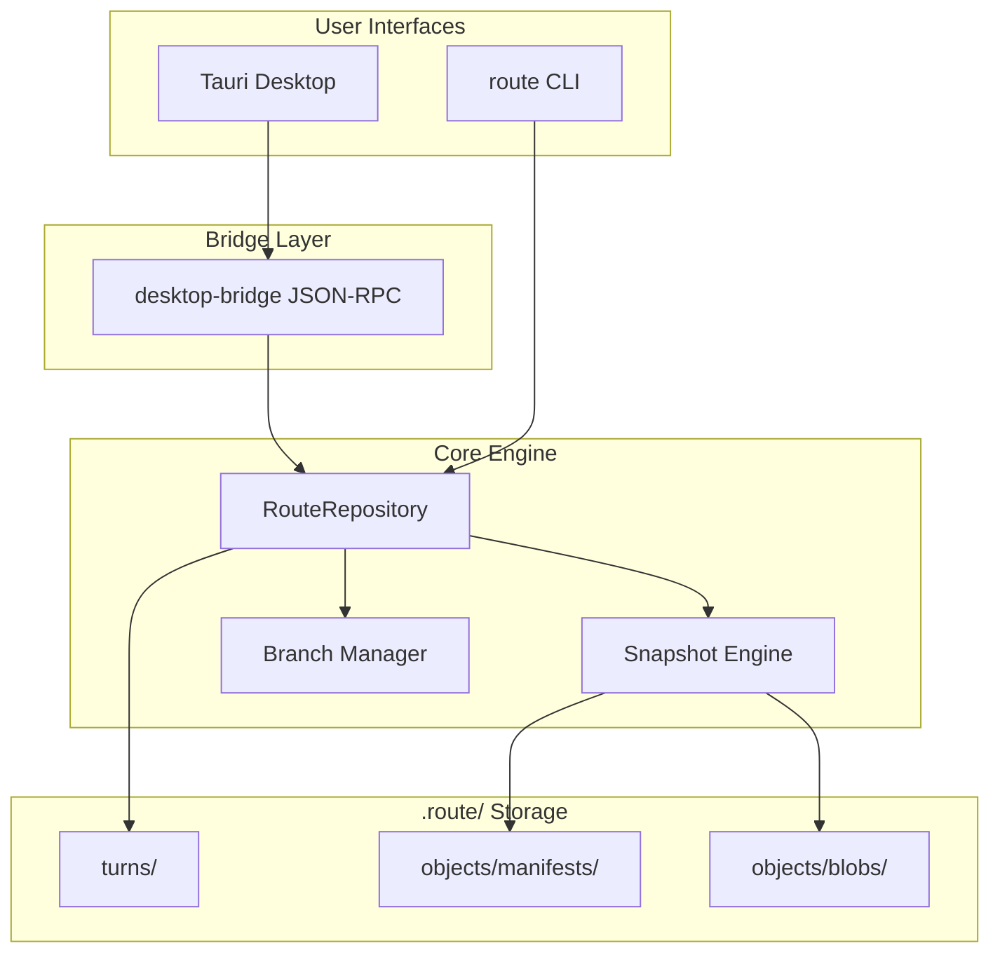

# Route 架构

## 设计目标

1. **比 Git 更简单** — 无 staging area、无复杂 merge conflict UI
2. **对话优先** — 最小版本单元 = 一轮用户-AI 对话
3. **性能** — 混合增量/全量备份，内容寻址去重
4. **双通道** — 桌面 GUI + CLI，CLI 供 AI 自动化

## 模块

## 对话轮次（Turn）

每个 Turn 包含：

- 用户指令 (`userMessage`)
- AI 摘要 (`aiSummary`)
- 可选的四点指令元数据 (`instruction`)
- 关联快照 (`snapshotId`)
- 变更文件列表 (`changedFiles`)

回退时，Route 解析目标 Turn 的 manifest 链，将项目文件恢复到该状态。

## 分支语义

| 操作 | 行为 |
|------|------|
| 创建 | 从当前分支 HEAD 分叉 |
| 暂停 | `status = paused`，拒绝新 commit |
| 恢复 | `status = active` |
| 删除 | 不能删当前分支或唯一分支 |
| 并入 | 默认 `new-wins`：源分支文件覆盖目标分支冲突项 |

## Mode 1 vs Mode 2

| | Mode 1（当前） | Mode 2（计划） |
|---|----------------|----------------|
| 备份 | Route 自研 `.route/` | 调用系统 `git` |
| 权限 | 仅需文件读写 | 需 Git + 可能的全局配置 |
| 对话单元 | 原生支持 | 需映射到 git commit message |
| 风险 | 低 | 需显式风险确认 |

## 性能考量

- `fast-glob` 并行扫描项目文件
- SHA-256 内容寻址 — 相同文件只存一份
- 增量 manifest 链 — 避免每轮全量复制
- 每 N 轮（默认 10）强制全量快照 — 加速回退解析
